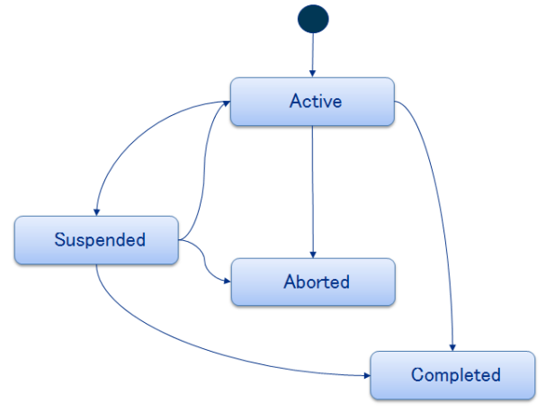

## Documento di Esenzione
In base a determinate condizioni cliniche, di reddito o sociali alcune prestazioni mediche sono erogate dal Servizio Sanitario Nazionale gratuitamente (esenzioni) dietro pagamento di un ticket. Il Documento di Esenzione è un documento che descrive la tipologia di esenzioni posseduta dall’assistito che può essere totale o parziale. Le principali tipologie di esenzioni sono di seguito riassunte:
- _Reddito_
- _Età_
- _Presenza di determinate tipologie_
- _Riconoscimento dello stato di invalidità_
- _Altri casi particolari_ (gravidanza, vaccini, etc.)
### Header*
- ***code***: esempio di utilizzo
  ```xml
  <code code="57827-8"
        codeSystem="2.16.840.1.113883.6.1"
        codeSystemName="LOINC"
        codeSystemVersion="2.19"
        displayName="Documento di Esenzione"/>
  ```
- ***recordTarget***: l’elemento __recordTarget/patientRole__ ha un attributo __recordTarget/patientRole/@classCode__ che assume il valore fisso ``“PAT”``.
  ```xml
    <recordTarget>
      <patientRole classCode="PAT">
        <id root="2.16.840.1.113883.2.9.4.3.2"
            extension="PPRPLN20H09D969W" assigningAuthorityName="Ministero Economie e
            375 Finanze" displayable="true"/>
        <id root="2.16.840.1.113883.2.9.2.70.4.1.2"
            extension="000.327.897" assigningAuthorityName="Regione Liguria"
            displayable="true"/>
  ```
- ***author***: identifica la partecipazione del soggetto o del sistema che ha creato il documento di esenzione CDA. Se l’autore è identificabile con una persona DEVE essere registrato come ``assignedAuthor/assignedPerson``, altrimento nel caso software come ``assignedAuthor/assignedAuthoringDevice``. 
  ```xml
  <author typeCode="AUT"/>
    <assignedAuthor>
      <id root="2.16.840.1.113883.2.9.70.4.5" 
          extension="SISSLIG_ASR" 
          assigningAuthorityName="Regione Liguria" 
          displayable="true"/>
  ```
  - __author/assignedAuthor/__ ***assignedPerson***:
    ```xml
    <assignedPerson>
      <name>
        <family>ROSSI</family>
        <given>MARIO</given>
        <prefix>Sig.</prefix>
      </name>
    </assignedPerson>
    ```
  - _author/assignedAuthor/_ ***assignedAuthoringDevice***:
    ```xml
    <assignedAuthoringDevice>
      <softwareName>ANAGRAFE SANITARIA REGIONALE LIGURE</softwareName>
      <manufacturerModelName 
        code="ASO"
        codeSystem="2.16.840.1.113883.2.9.3.24.1" 
        codeSystemName="Liguria Digitale S.p.A. - Progetti Sanità" 
        displayName="ASO"> ANAGRAFE SANITARIA REGIONALE LIGURE – OPERATORE DI SPORTELLO
      </manufacturerL’elemento section/entry contiene le informazioni dell’esenzione specifica ModelName>
    </assignedAuthoringDevice>
    ```
  - _author/assignedAuthor/representedOrganization_: rappresenta la struttura organizzativa a cui appartiene il creatore del documento. 
  Esempio di utilizzo:
    ```xml
    <representedOrganization>
      <id root="2.16.840.1.113883.2.9.4.1.1" extension="070" 
          assigningAuthorityName="ISTAT" displayable="true"/>
      <name>REGIONE LIGURIA</name>
    </representedOrganization>
    ```
### Body
Il CDA R2 di esenzione contiene un SOLO elemento <section>, che contiene le informazioni sulle esenzioni che saranno di tipo narrativo e di tipo codificato.
 | Sezioni        | Codici LOINC | Descrizioni LOINC ShortName                     |
  |----------------|--------------|-------------------------------------------------|
  | Esenzione | 57827-8      | "Motivo di esenzione dal co-pagamento |
- __clinicalDocument/component/structuredBody/component/section__: 
  ```xml
  <component>
    <structuredBody>
      <component>
        <section>
        <templateId root="2.16.840.1.113883.2.9.10.1.6.2.1"/>
        <id root="9154da1c-6fb6-412f-8b45-f56233d2f489"/>
        <code code="57827-8" 
            codeSystem="2.16.840.1.113883.6.1" codeSystemName="LOINC"
            displayName="Motivo di esenzione dal co-pagamento"/>
        <title>Esenzione</title>
        ...
  ```

  > Per questa sezione:
  > - è OBBLIGATORIO indicare la root del template di sezione, che corrisponde ad un OID
  > - è OPZIONALE utilizzare un identificativo univoco (e.g. UUID) per la sezione
  > - è OBBLIGATORIO indicare il codice di sezione, basato sulla codifica LOINC
  > - è OBBLIGATORIO aggiungere il titolo della sezione
  > - è OBBLIGATORIO inserire il blocco narrativo
  > - è OBBLIGATORIO inserire le entry strutturate che codificano le esenzioni specifiche.

- section/ __entry/act__ (blocco strutturato): contiene i dati identificativi e descrittivi dell’esenzione specifica posseduta dall’assistito.
  > - l’attributo section/entry/@classCode DEVE essere valorizzato con “ACT”
  > - l’attributo section/entry/@moodCode DEVE essere valorizzato con “EVN”

  Esempio di utilizzo:
  ```xml
  <entry typeCode="DRIV">
    <act classCode="ACT" moodCode="EVN">
  ```
  - __templateId__:  indica il template di riferimento dell’act utilizzato per descrivere il contenuto strutturato del documento di esenzione. ```<templateId root="2.16.840.1.113883.2.9.10.1.10.3"/>```
  - __code__: indica il codice e la descrizione dell’esenzione specificatamente attribuita all’assistito secondo catalogo nazionale o regionale.
    - _codeSystem_: rappresenta l’OID di uno dei seguenti sistemi di codifica e DEVE assumere come valore ``2.16.840.1.113883.2.9.6.1.22`` (nazionale) o ``2.16.840.1.113883.2.9.2.[REGIONE].6.22`` (regionale).
    - _displayName_: descrizione del codice dell’esenzione nel catalogo utilizzato.
    
    Esempio di utilizzo:
    ```xml
    <code code="016.07032" 
          codeSystem="2.16.840.1.113883.2.9.6.1.22" 
          codeSystemName="Catalogo nazionale delle esenzioni"
          displayName="Epatite Cronica (attiva)"/>
    ```
  - section/entry/act/__statusCode__: contiene lo stato dell’esenzione specifica al momento della produzione del documento. Un documento di esenzione può trovarsi in uno dei seguenti stati:
    - active: l’esenzione corrispondente è in corso di validità;
    - suspended: l’esenzione corrispondente è stata momentaneamente sospesa;
    - aborted: l’esenzione corrispondente non è mai stata valida;
    - completed: l’esenzione corrispondente non è più in corso di validità;
    
  - section/entry/act/__effectiveTime__: indica la data di inizio e di fine validità dell'esenzione.
    ```xml
    <effectiveTime>
      <low value="20170523"/>
      <high value="20180523"/>
    </effectiveTime>
    ```
